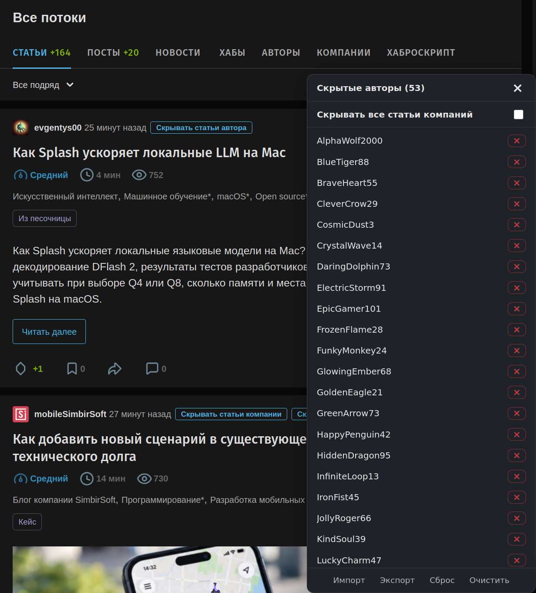

# Хаброскрипт
Userscript для скрытия публикаций от заблокированных авторов и компаний из ленты Хабра.  

Внешний вид
  
  
  

  

## Возможности
- Удаление публикаций из ленты для пользователей и компаний из чёрного списка
- Опция для скрытия всех публикаций из корпоративных блогов
- Импорт и экспорт чёрного списка через текстовый файл
- Удобные кнопки для скрытия публикаций в ленте, в режиме чтения и при просмотре профиля

## Установка
Используйте расширения для управления пользовательскими скриптами, такие как Tampermonkey, Violentmonkey, Greasemonkey, ScriptCat и им подобные.
